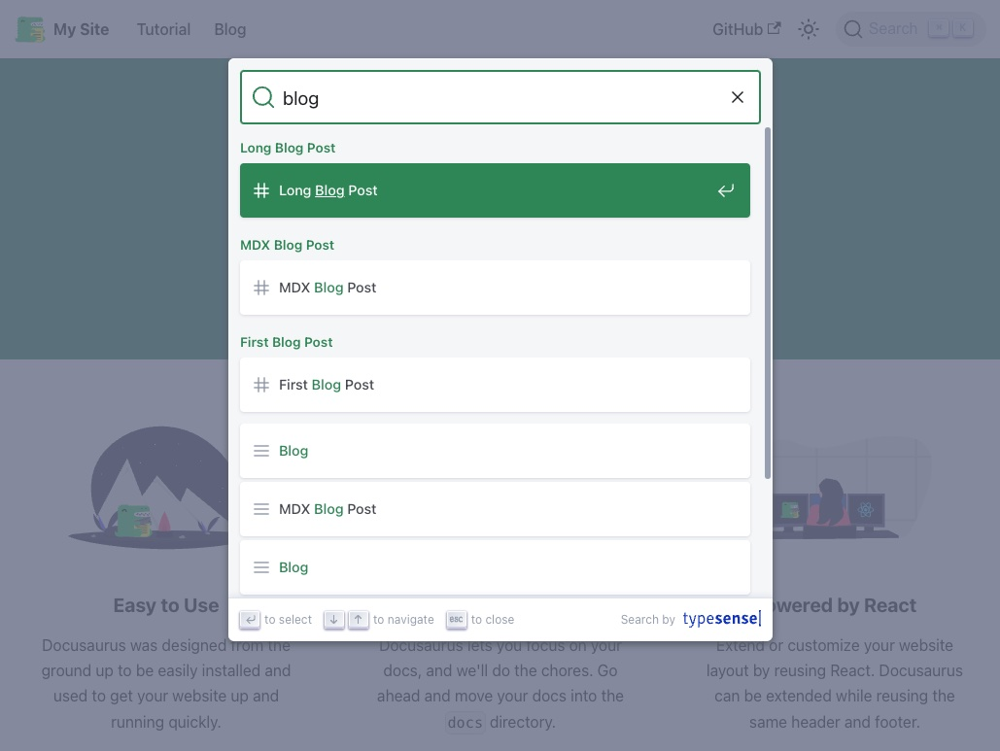

# Docusaurus with Typesense Search

This repository contains a simple demo about using [Docusaurus](https://docusaurus.io/) with [Typesense](https://typesense.org/) search engine, all to be self-hosted.



## Getting Started

- Install [Docker](https://www.docker.com/) and [Node.js](https://nodejs.org/en)
- Clone the repository and install dependencies

    ```bash
    # Clone the repository
    git clone https://github.com/juhamust/docusaurus-typesense-search.git
    cd docusaurus-typesense-search

    # Install dependencies
    npm install
    ```

- Start the Typesense server

    ```bash
    # Start the Typesense server and make sure it is running
    npm run start:typesense
    docker ps
    ```

- Build the Docusaurus website and serve it

    ```bash
    npm run build:docusaurus
    npm run serve:docusaurus
    ```

  **NOTE**: The command will run with sudo because it needs to bind to port 80 (the scraper requires to use port 80/443)

- Scrap the website and index it in Typesense

    ```bash
    # Runs the Typesense scraper script
    npm run build:index | grep -E 'records|hits' 
    ```

- Test the search functionality

    Open the browser and navigate to `http://localhost/` and try to search for something. Shortcut to search: `Ctrl + K`
    